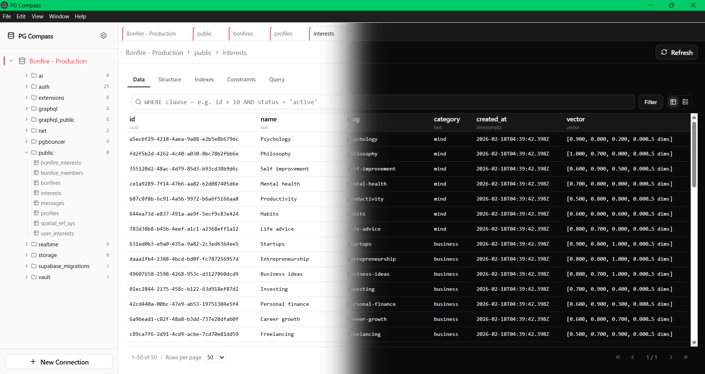

# PG Compass

A fast, minimal desktop database viewer for **PostgreSQL**, inspired by the usability of [MongoDB Compass](https://www.mongodb.com/products/compass).

**Yet another PostgreSQL GUI?**

> Most PostgreSQL tools are either bloated IDE-style apps (pgAdmin, DataGrip) with features you never use, or primitive CLI wrappers. PG Compass sits in the sweet spot — a focused, fast tool for the thing developers actually do most: _inspecting data_.


---

## Features

- 🐘 **Built for PostgreSQL** — schema-first navigation with first-class support for schemas, tables, views, indexes, and constraints.
- ⚡ **Fast & lightweight** — Electron + React, optimized for instant data loading and minimal resource usage.
- 🔌 **Multiple connections** — save, label, and color-code connections. Favorite the ones you use most.
- 📊 **Table data viewer** — paginated row browsing (25/50/75/100 per page) with a card view for JSONB-heavy tables.
- 🏗️ **Structure inspector** — view columns, data types, indexes, and constraints at a glance.
- 📥 **Export** — export query results and table data as CSV or JSON.
- 🔍 **SQL query editor** — run ad-hoc queries with inline result previews.
- 🌓 **Dark/Light mode** — dark by default, because we're not animals.
- 🛟 **Type-safe** — fully written in TypeScript with type-safe IPC between Electron processes.
- 🔓 **Open source** — MIT licensed, no accounts, no telemetry, no nonsense.



## Getting Started

### Prerequisites

- [Node.js](https://nodejs.org/) 20.19+
- [pnpm](https://pnpm.io/) 9+

### Installation

```bash
# Clone the repository
git clone https://github.com/waterrmalann/pg-compass.git
cd pg-compass

# Install dependencies
pnpm install

# Run the development app
pnpm dev
```

### Building for Production

```bash
# Package the Electron app
pnpm --filter @pg-compass/desktop package

# Or create distributable installers
pnpm --filter @pg-compass/desktop make
```

### Running Tests

```bash
# Unit and integration suites
pnpm test

# Fast integration suite only
pnpm test:integration

# Authoritative PostgreSQL-backed integration suite
pnpm test:integration:postgres

# Coverage
pnpm test:coverage

# Electron Playwright
pnpm test:e2e
```

## Project Structure

This is a [Turborepo](https://turborepo.dev/) monorepo:

```
apps/
  desktop/          # Electron + React desktop app
  landing/          # Marketing landing page (Astro + Tailwind)
packages/
  ui/               # Shared React component library
  eslint-config/    # Shared ESLint configurations
  typescript-config/ # Shared TypeScript configurations
docs/               # Project documentation & decision records
```

### Tech Stack

| Layer     | Technology                           |
| --------- | ------------------------------------ |
| Framework | Electron (Forge + Vite)              |
| Frontend  | React 19, Tailwind CSS v4, shadcn/ui |
| Database  | node-postgres (`pg`)                 |
| Language  | TypeScript                           |
| Tooling   | Turborepo, pnpm, ESLint, Prettier    |

## Contributing

Contributions are welcome! Some areas you could help with:

- Bug fixes and stability improvements
- UI/UX refinements
- New table viewer features (filtering, sorting, inline editing)
- Query editor enhancements (syntax highlighting, autocomplete)
- Accessibility improvements
- Testing (unit, integration, E2E)
- Documentation

## License

MIT License — see [LICENSE](LICENSE) for details.

---

If this project helps you, consider giving it a ⭐ on GitHub!
